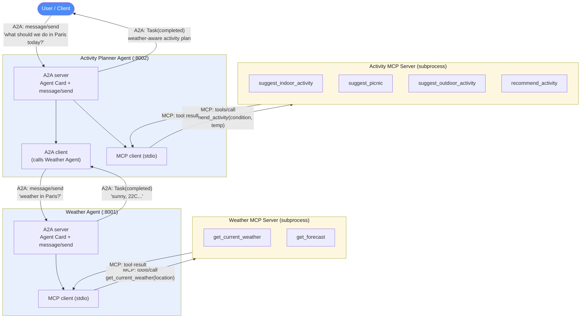

# A2A + MCP Demo: Weather Agent x Activity Planner Agent

A small, runnable prototype that shows two patterns from the course working
together:

- **MCP** for an agent's *internal* tools (an agent talking to its own
  tool server over stdio).
- **A2A** (Agent-to-Agent) for *inter-agent* communication (one agent
  discovering and calling another agent over HTTP).

Two toy agents:

| Agent | Internal MCP tools | A2A skill |
|---|---|---|
| **Weather Agent** | `get_current_weather`, `get_forecast` (real data via [XWeather](https://www.xweather.com/docs/weather-api), auto-fallback to a mock) | `get_weather` |
| **Activity Planner Agent** | `suggest_indoor_activity`, `suggest_picnic`, `suggest_outdoor_activity`, `recommend_activity` | `plan_activity` |

The Activity Planner doesn't know how to check the weather itself. When it
gets a request like *"what should we do in Paris today?"*, it calls the
Weather Agent **over A2A**, then feeds the answer into its own **MCP**
`recommend_activity` tool to pick indoor / picnic / outdoor suggestions.

### Real weather data (optional)

`weather_agent/mcp_server.py` calls the [XWeather API](https://www.xweather.com/docs/weather-api)
(`/observations` for current conditions, `/forecasts` for forecasts) when
credentials are set. XWeather's only supported auth method is a **Client ID
+ Client Secret pair** (both required on every request — there's no
single-key mode). Sign up at [xweather.com](https://www.xweather.com/) and
register an app; the dashboard issues both values together.

```bash
cp .env.example .env
# then edit .env:
#   XWEATHER_CLIENT_ID=...
#   XWEATHER_CLIENT_SECRET=...
```

`.env` is loaded automatically (via `common/env.py`, imported by both
agents and `run_demo.py`) — no need to `export` anything by hand, and
`.env` is gitignored so the keys never get committed.

Without credentials (or if a request fails), the tools transparently fall
back to a deterministic mock generated from `location + date` — so the
demo, the notebook, and `run_demo.py` all still run offline with zero
setup. Every weather response is tagged `"source": "xweather"` or
`"source": "mock"` so you can always tell which one you got; the Activity
Planner surfaces this as `[weather data: xweather|mock]` in its replies.

## Why a custom A2A layer instead of `a2a-sdk`?

`common/a2a_protocol.py` is a ~150-line implementation of the *shape* of the
real [A2A protocol](https://a2a-protocol.org): an Agent Card served at
`/.well-known/agent.json`, and a `message/send` JSON-RPC 2.0 method that
returns a `Task` wrapping the reply. It's deliberately minimal so the whole
request/response path fits in one readable file for learning purposes. The
concepts map 1:1 onto the official `a2a-sdk` if you want to graduate this
prototype to the real thing.

## Project layout

```
a2a-demo/
├── common/
│   ├── a2a_protocol.py     # Agent Card + JSON-RPC message/send (client + server)
│   └── mcp_client.py       # stdio MCP session helper
├── weather_agent/
│   ├── mcp_server.py       # MCP server: get_current_weather, get_forecast
│   └── agent.py            # A2A server wrapping the MCP server
├── activity_agent/
│   ├── mcp_server.py       # MCP server: suggest_*, recommend_activity
│   └── agent.py            # A2A server; also an A2A *client* of the Weather Agent
├── notebook/
│   └── a2a_prototype.ipynb # step-by-step prototype: MCP tools -> A2A agents -> orchestration
└── run_demo.py             # launches both agents and runs sample queries end-to-end
```

## Running it

```bash
cd projects/a2a-demo
uv sync --extra notebook   # installs mcp, fastapi, uvicorn, httpx, jupyter...
uv run python run_demo.py
```

This starts both agent processes, waits for them to come up, sends a few
sample requests to the Activity Planner Agent, and prints the full
agent-to-agent exchange, then shuts everything down.

To run the agents by hand instead (e.g. to poke at them with `curl`):

```bash
uv run python weather_agent/agent.py --port 8001
uv run python activity_agent/agent.py --port 8002 --weather-agent-url http://localhost:8001
```

```bash
curl http://localhost:8002/.well-known/agent.json | python3 -m json.tool

curl -s http://localhost:8002/ -X POST -H "content-type: application/json" -d '{
  "jsonrpc": "2.0", "id": "1", "method": "message/send",
  "params": {"message": {"role": "user", "parts": [{"kind": "text", "text": "what should we do in Paris today?"}]}}
}' | python3 -m json.tool
```

Or open `notebook/a2a_prototype.ipynb` to walk through the same system
piece by piece: calling the MCP tools directly first, then wrapping them in
A2A agents, then watching the Activity Planner orchestrate a call to the
Weather Agent.

For a visual walkthrough of the system, open `architecture.html` directly in
any browser (no server needed) — it's the same diagram as below, styled and
interactive-free, and travels as a single portable file.

## Architecture



**Two protocols, two jobs:**
- **A2A** (solid boxes: Activity Planner <-> Weather Agent) — peer agents,
  each with its own Agent Card, discoverable and callable over HTTP/JSON-RPC.
- **MCP** (each agent <-> its own subprocess server) — an agent's private
  toolbox, not exposed to other agents.
